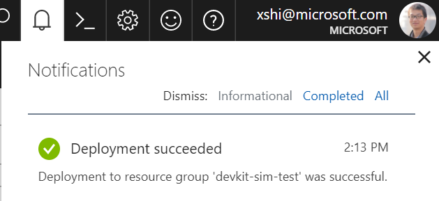
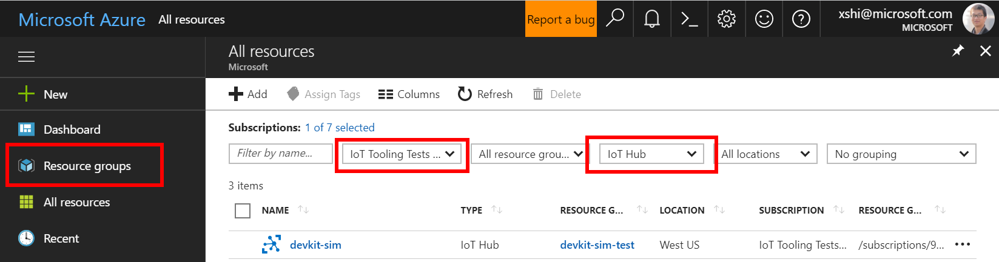
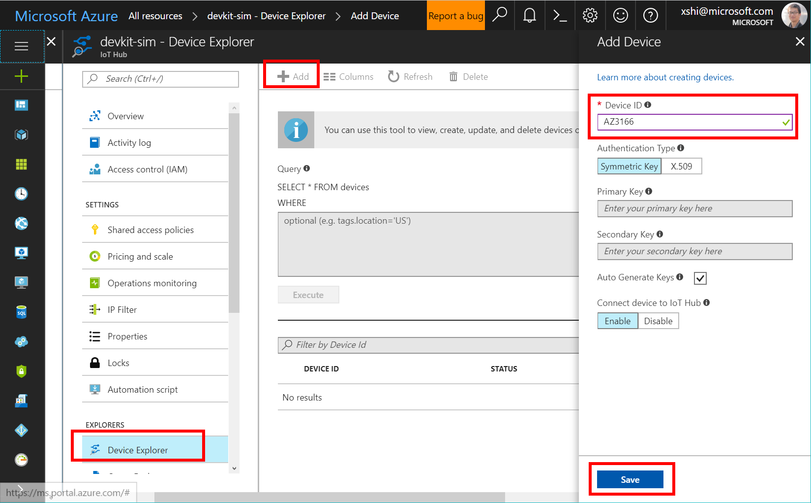
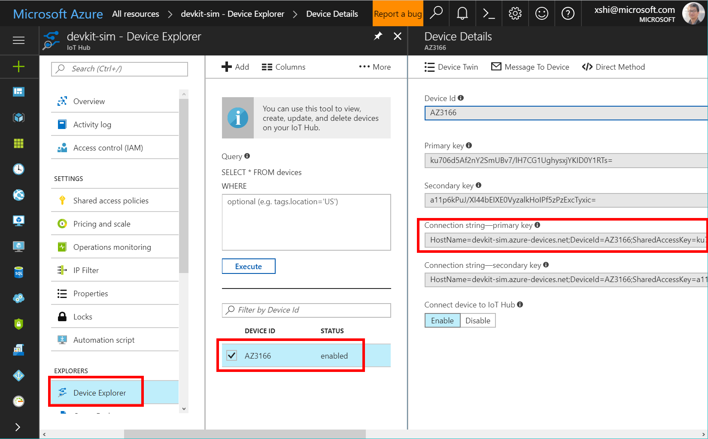
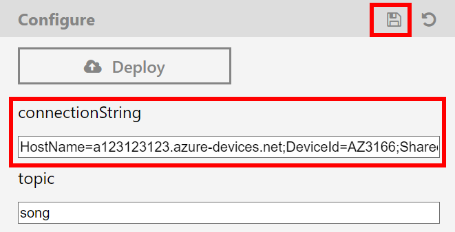

# MXChip IoT DevKit Web Simulator
A browser-based simulator for you to try [MXChip IoT DevKit](https://microsoft.github.io/azure-iot-developer-kit/).

Click to visit **[Demo page](https://vschina.github.io/devkit-playground/build/index.html)** 

[Buy a real DevKit](https://aka.ms/iot-devkit-purchase) to develop IoT app with Microsoft Azure and Visual Studio Code.

## Project - IoT Hub Get Started 
Under Construction...

## Project - Shake, Shake for a Tweet
The shake shake project uses the motion sensor to detect shaking and find a random tweet with a #hashtag.

### Deploy your Azure Resource Manager (ARM) template

By clicking the **Deploy** button in the configure area, you are navigated to Azure portal to sign in your Azure account.

> [!NOTE]
> If you don't have an Azure account, create a free [Azure trial account](https://azure.microsoft.com/free/) in just a few minutes.

After you successfully sign in, you can see the ARM custom deployment page. This page is for you to choose and fill in necessary information for the custom deployment.

- **Subscription**: Choose the subscription you want to use.
- **Resource Group**: Create a resource group to host the IoT hub or use an existing one. For more information, see [Use resource groups to manage your Azure resources](https://docs.microsoft.com/en-us/azure/azure-resource-manager/resource-group-portal).
- **Location**: Select the closest location to you where the IoT hub is created.
- **IoT Hub Name**: Enter the name of your IoT hub. If the name you enter is valid, a green check mark appears.
 
Agree the terms and conditions stated in this page and click **Purchase** to start the deployment. It might take about three minutes to finish the deployment. You can track the progress by clicking the notification button.

### Create an AZ3166 Device in your IoT Hub

After your deployment is finished, go to Azure portal and click **All Resources** and find the IoT hub you provisioned.

Click the IoT Hub name and click the **Device Explorer**. In the Device Explorer pane, click **Add** to add a device to your IoT hub. Then do the following:

1. **Device ID**: Enter **AZ3166**.
2. **Authentication** Type: Select Symmetric Key.
3. **Auto Generate Keys**: Select this check box.
4. **Connect device to IoT Hub**: Click Enable.
5. Click **Save**.

After the device is created, open the device in the Device Explorer pane. Copy the **primary key of the connection string**. You need this to fill into the DevKit simulator configuration area.

### Configure your DevKit

Paste the **primary key of the connection string** into the configuration area and click the save icon.

'

You can also update the #hashtag, the default value is song. Don't forget to click the sa

### Run this app and shake your DevKit with your mouse.

Under Construction...